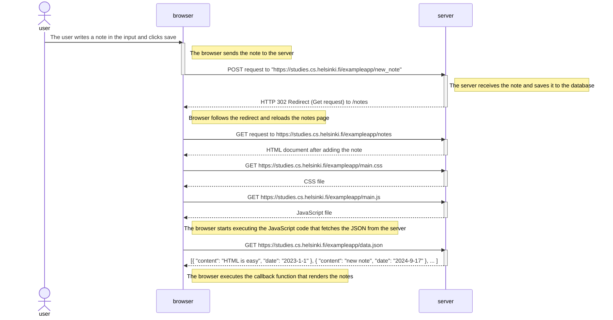

```mermaid
sequenceDiagram
    actor user
    participant browser
    participant server

    user ->> browser: The user writes a note in the input and clicks save
    activate browser 
    Note right of browser: The browser sends the note to the server

    browser ->> server: POST request to "https://studies.cs.helsinki.fi/exampleapp/new_note"
    deactivate browser
    activate server

    Note right of server: The server receives the note and saves it to the database
    server -->> browser: HTTP 302 Redirect (Get request) to /notes
    deactivate server

    Note right of browser: Browser follows the redirect and reloads the notes page

    browser->>server: GET request to https://studies.cs.helsinki.fi/exampleapp/notes
    activate server
    server-->>browser: HTML document after adding the note
    deactivate server

    browser->>server: GET https://studies.cs.helsinki.fi/exampleapp/main.css
    activate server
    server-->>browser: CSS file
    deactivate server
    
    browser->>server: GET https://studies.cs.helsinki.fi/exampleapp/main.js
    activate server
    server-->>browser: JavaScript file
    deactivate server

     Note right of browser: The browser starts executing the JavaScript code that fetches the JSON from the server

    browser->>server: GET https://studies.cs.helsinki.fi/exampleapp/data.json
    activate server
    server-->>browser: [{ "content": "HTML is easy", "date": "2023-1-1" }, { "content": "new note", "date": "2024-9-17" }, ... ]
    deactivate server

    Note right of browser: The browser executes the callback function that renders the notes


```
