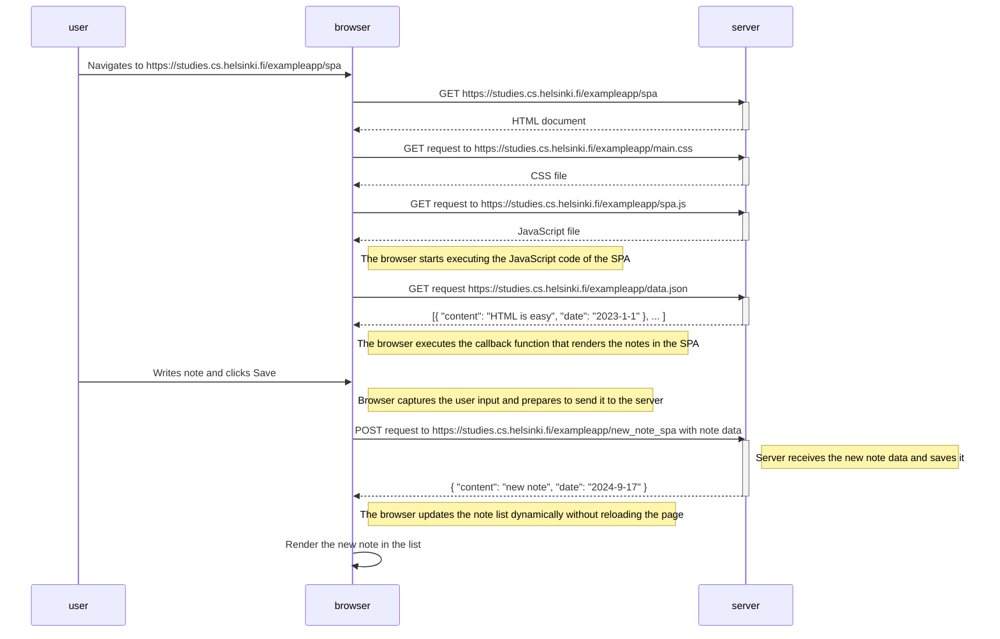

```mermaid
sequenceDiagram
    participant user
    participant browser
    participant server

     user->>browser: Navigates to https://studies.cs.helsinki.fi/exampleapp/spa
    browser->>server: GET https://studies.cs.helsinki.fi/exampleapp/spa
    activate server
    server-->>browser: HTML document
    deactivate server

    browser->>server: GET request to https://studies.cs.helsinki.fi/exampleapp/main.css
    activate server
    server-->>browser: CSS file
    deactivate server

    browser->>server: GET request to https://studies.cs.helsinki.fi/exampleapp/spa.js
    activate server
    server-->>browser: JavaScript file
    deactivate server

    Note right of browser: The browser starts executing the JavaScript code of the SPA

    browser->>server: GET request https://studies.cs.helsinki.fi/exampleapp/data.json
    activate server
    server-->>browser: [{ "content": "HTML is easy", "date": "2023-1-1" }, ... ]
    deactivate server

    Note right of browser: The browser executes the callback function that renders the notes in the SPA

    user->>browser: Writes note and clicks Save
    Note right of browser: Browser captures the user input and prepares to send it to the server

    browser->>server: POST request to https://studies.cs.helsinki.fi/exampleapp/new_note_spa with note data
    activate server
    Note right of server: Server receives the new note data and saves it
    server-->>browser: { "content": "new note", "date": "2024-9-17" }
    deactivate server

    Note right of browser: The browser updates the note list dynamically without reloading the page
    browser->>browser: Render the new note in the list

```